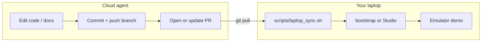

# Cloud workspace → laptop

Use the **Cursor Cloud Agent** environment as the project hub: edit code, update docs, open PRs, and run Gradle checks that do not need Google or court CDNs. When your laptop is online, **pull the same repo** and run the heavy, visual work there—build, emulator, demos, and asset downloads.

This doc is the map between those two places.

---

## What lives where

| Task | Cloud agent | Your laptop |
| --- | --- | --- |
| Kotlin / Compose / Gradle source edits | Yes | Yes (after `git pull`) |
| Docs, landing copy, QA checklist | Yes | Yes |
| `git commit` / push / PRs | Yes (agent) | Yes (you) |
| `scripts/fetch_assets.sh` (uscourts.gov PDFs) | Often blocked | Run locally |
| `scripts/fetch_fonts.sh` | May be blocked | Run locally |
| `bootstrap.sh` (SDK, emulator, KVM) | Not in sandbox | Run on real Ubuntu desktop |
| Pixel 9 emulator + live demo | No | Yes |
| Install debug APK to emulator | No | Yes |

The cloud side is for **accessing and changing the project**. The laptop is for **running Forseti** and **showing it to people**.

---

## Daily loop (recommended)



1. **Cloud** — Describe what you want; the agent works on a `cursor/…-68c3` branch and pushes to GitHub.
2. **Laptop** — When connected:
   ```bash
   cd ~/Desktop/Projects/Forseti   # or wherever you keep the clone
   bash scripts/laptop_sync.sh
   ```
3. **First time on that machine** (or after OS reinstall):
   ```bash
   bash bootstrap.sh --skip-launch    # SDK + deps, no emulator yet
   bash bootstrap.sh --launch-only    # build, install, open app
   ```
   Details: [RUN_LOCALLY.md](RUN_LOCALLY.md).

4. **Demo for someone** — Start the emulator, install debug, launch:
   ```bash
   bash scripts/run_emulator.sh          # if you use repo scripts
   # or double-click desktop shortcuts after bootstrap
   ./gradlew :app:installDebug
   adb shell am start -n com.forseti.debug/com.forseti.MainActivity
   ```
   Walkthrough: [QA_CHECKLIST.md](QA_CHECKLIST.md).

---

## Laptop sync script

`scripts/laptop_sync.sh` (run **on the laptop**, not in cloud):

- `git fetch` + `git pull` (current branch, or pass a branch name)
- Optional `--assets` → `fetch_assets.sh`
- Optional `--fonts` → `fetch_fonts.sh`
- Prints the exact next command for build / emulator

Example after a cloud agent PR is merged to `main`:

```bash
cd ~/Desktop/Projects/Forseti
bash scripts/laptop_sync.sh --assets
bash bootstrap.sh --launch-only
```

To test a **feature branch** before merge:

```bash
bash scripts/laptop_sync.sh cursor/some-feature-68c3 --assets
```

---

## Offline or USB (no git on the road)

If you cannot pull from GitHub, pack the tree from either environment:

**From cloud** (after agent changes are committed) or **from laptop**:

```bash
bash scripts/pack_for_laptop.sh
# Creates ../forseti-laptop-YYYYMMDD.tar.gz (no build caches)
```

Copy the archive to the laptop (USB, Drive, `scp`), then:

```bash
tar -xzf forseti-laptop-*.tar.gz -C ~/Desktop/Projects/
cd ~/Desktop/Projects/Forseti
bash scripts/laptop_sync.sh --assets --skip-pull
```

`--skip-pull` only fetches assets/fonts; use it when the tree already came from the tarball.

---

## Emulator on another Linux PC (portable demo kit)

For a second machine or a USB stick with ~8 GB free, use the existing portable emulator flow:

| Step | Command / doc |
| --- | --- |
| Build portable emulator on a machine that already has the SDK | `bash scripts/copy_emulator_to_usb.sh [/media/you/USB]` |
| Set up the other PC | Read `AndroidPortable/SETUP_OTHER_PC.txt` on the USB |
| One-shot setup on new PC | `~/AndroidPortable/scripts/setup_portable_emulator_on_pc.sh` |
| Launch | Desktop shortcut **Android Emulator (Pixel 9 portable)** |

Put the **Forseti repo** on the same USB under `Forseti/` if you want install-without-network after sync:

```bash
export ANDROID_HOME=~/AndroidPortable/Sdk
cd /path/to/Forseti
./gradlew :app:installDebug
```

---

## What to pull from the project (checklist)

When continuing on the laptop, you typically need:

- [ ] Latest `git` tree (or `pack_for_laptop` archive)
- [ ] `app/src/main/assets/` populated (`fetch_assets.sh`)
- [ ] Fonts under `res/font/` (`fetch_fonts.sh` or `bootstrap.sh`)
- [ ] `local.properties` with `sdk.dir=` (bootstrap creates this)
- [ ] Android SDK + `Pixel_9_API_35` AVD (bootstrap or portable `AndroidPortable`)
- [ ] KVM / GPU for smooth emulator ([RUN_LOCALLY.md](RUN_LOCALLY.md) troubleshooting table)

Secrets (release signing) stay **only** on your laptop: `keystore.properties` is gitignored; see [RELEASE_SIGNING.md](RELEASE_SIGNING.md).

---

## Remote work without the emulator

You can keep coding on the laptop with Studio + Gradle only:

```bash
bash scripts/laptop_sync.sh --assets
./gradlew :app:assembleDebug
```

Use a physical Android device over USB (`adb devices`) if you do not need the on-screen emulator for a meeting.

---

## Related docs

- [RUN_LOCALLY.md](RUN_LOCALLY.md) — full toolchain and emulator setup
- [FORSETI_PROJECT_BRIEF.md](FORSETI_PROJECT_BRIEF.md) — architecture for agents
- [QA_CHECKLIST.md](QA_CHECKLIST.md) — demo walkthrough
- [README.md](../README.md) — project overview
